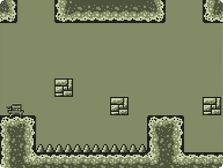
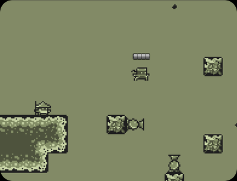

# NinjaTime

You are a ninja! Your sensei is training you to become the greatest ninja the world has ever seen.
With the power to slow time and teleport from one place to the other in the blink of an eye you must prove yourself worthy of the ninja title!

Play with mouse and keyboard for better experience.

Controls:

A -------------------------------------	WALK LEFT

D -------------------------------------	WALK RIGHT

W -------------------------------------	JUMP/DOUBLE JUMP

SPACE ---------------------------------	INTERACT

LEFT SHIFT ----------------------------	SLOW TIME

LEFT or RIGHT MOUSE BUTTON ------------	TELEPORT

Huge thanks for Kenney (http://www.kenney.nl/) for the ninja sprites and for David (http://opengameart.org/users/littlesadnerd) for all the other sprites used in the game.
Check out their work!

Special thanks for Kauê (http://kauelopes.github.io/) for testing the game at all stages and giving opinions on the project.
